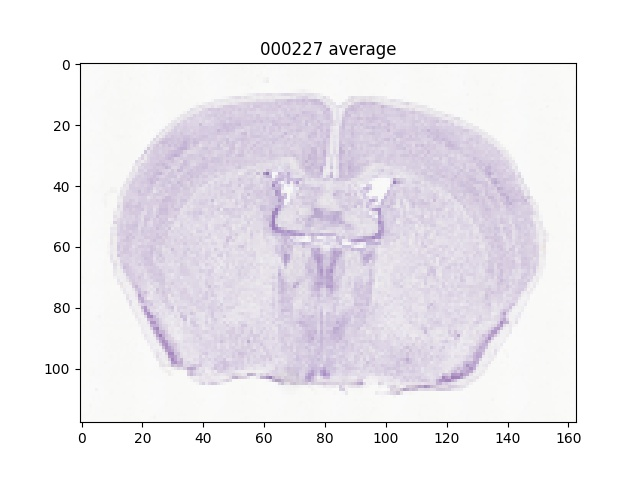
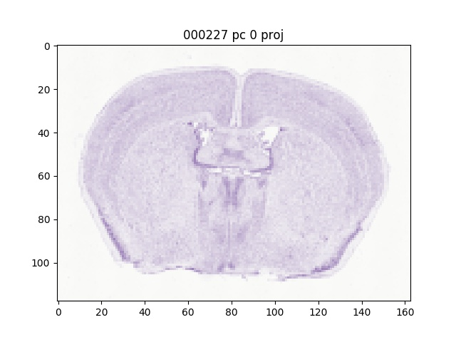
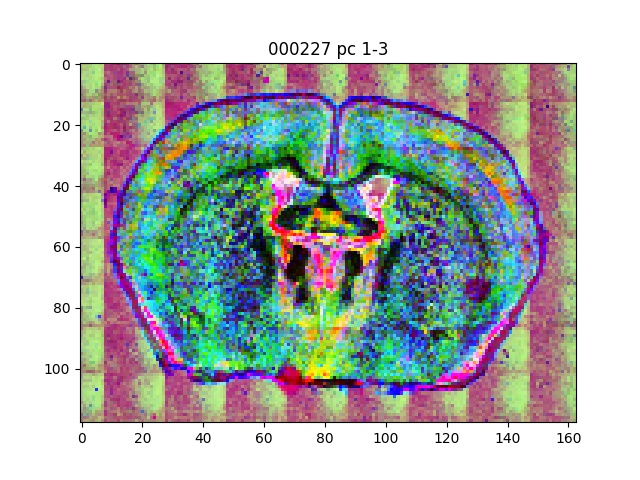

# scatter_downsample

This repository uses scattering transforms to downsample microscopy images without losing information about texture.

The resulting images have a low resolution, but a large number of features at each pixel.

Here we show an example using Nissl images from the Allen Reference Atlas.

Downsampling an image using standard 2x2 averaging, leads to the following:

Applying a scattering transform gives a high dimensional signal, rather than a red-green-blue image.

The first PCA component can be used to reconstruct the above image almost exactly:

The further components can be mapped to red green and blue to reveal more detail.

